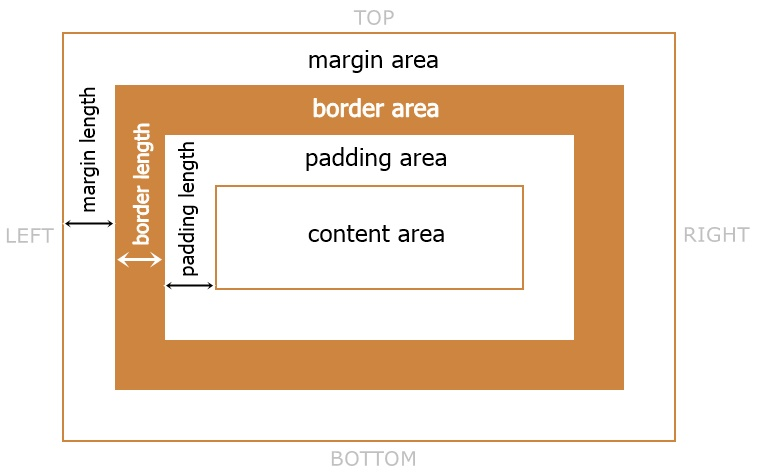

# CSS Box Model Rehberi

Bu rehber, CSS Box Model'in ne olduğunu, nasıl çalıştığını ve web tasarımında nasıl kullanıldığını detaylı bir şekilde açıklar. CSS Box Model, her HTML elemanını bir dikdörtgen kutu olarak ele alır ve bu kutuyu dört ana bölümle tanımlar: **içerik (content)**, **iç boşluk (padding)**, **çerçeve (border)** ve **dış boşluk (margin)**.

---

## Box Model Nedir?
CSS Box Model, bir HTML elemanının alanını hesaplamak için kullanılan bir konsepttir. Bir eleman, aşağıdaki dört ana bileşenden oluşur:

1. **İçerik (Content):** Metin, resim veya diğer içeriklerin bulunduğu alandır.
2. **İç Boşluk (Padding):** İçerik ile çerçeve (border) arasındaki boşluktur.
3. **Çerçeve (Border):** Elemanın etrafındaki çerçevedir.
4. **Dış Boşluk (Margin):** Eleman ile diğer elemanlar arasındaki boşluktur.

### Box Model Görseli

```plaintext
+-----------------------------+
|         Margin             |
+-----------------------------+
|         Border             |
+-----------------------------+
|         Padding            |
+-----------------------------+
|         Content            |
+-----------------------------+
```



---

## Box Model Bileşenleri

### 1. İçerik (Content)
Elemanın içinde bulunan metin, resim veya diğer içerikleri kapsayan alandır. İçeriğin genişliği (`width`) ve yüksekliği (`height`) burada tanımlanır.

#### Örnek:
```css
.box {
    width: 200px;
    height: 100px;
    background-color: lightblue;
}
```

---

### 2. İç Boşluk (Padding)
İçerik ile çerçeve arasında bir boşluk oluşturur. Padding, elemanın arka plan rengiyle aynı renkte görünür.

#### Örnek:
```css
.box {
    padding: 20px;
    background-color: lightblue;
}
```
- **Toplam Genişlik:** `width + padding-left + padding-right`
- **Toplam Yükseklik:** `height + padding-top + padding-bottom`

---

### 3. Çerçeve (Border)
Elemanın etrafında bir çerçeve oluşturur. Çerçeve, genişlik, stil ve renk gibi özelliklerle tanımlanabilir.

#### Örnek:
```css
.box {
    border: 5px solid black;
}
```
- **Toplam Genişlik:** `width + padding + border`
- **Toplam Yükseklik:** `height + padding + border`

---

### 4. Dış Boşluk (Margin)
Eleman ile diğer elemanlar arasındaki dış boşluktur. Margin, negatif değerler alabilir ve elemanlar arasında ek boşluk veya üst üste binme oluşturabilir.

#### Örnek:
```css
.box {
    margin: 10px;
}
```
- **Margin Çakışması:** İki dikey elemanın üst veya alt kenarları birbiriyle çakışabilir, daha büyük olan margin uygulanır.

---

## Box Model Hesaplama
Bir elemanın toplam boyutu, Box Model bileşenlerinin toplamıyla hesaplanır.

### Standart Box Model
```plaintext
Toplam Genişlik = width + padding-left + padding-right + border-left + border-right + margin-left + margin-right
Toplam Yükseklik = height + padding-top + padding-bottom + border-top + border-bottom + margin-top + margin-bottom
```

### Örnek:
```css
.box {
    width: 200px;
    height: 100px;
    padding: 10px;
    border: 5px solid black;
    margin: 20px;
}
```
**Toplam Genişlik:**
- İçerik: `200px`
- Padding: `10px + 10px = 20px`
- Border: `5px + 5px = 10px`
- Margin: `20px + 20px = 40px`
- **Toplam:** `200 + 20 + 10 + 40 = 270px`

**Toplam Yükseklik:** Aynı yöntemle hesaplanır.

---

## `box-sizing` Özelliği
`box-sizing` özelliği, elemanın boyut hesaplamasını değiştirmek için kullanılır.

### Değerler:
1. **`content-box`:** (Varsayılan) Sadece içerik genişliği ve yüksekliği tanımlanır. Padding ve border toplam genişlik/yüksekliğe dahil edilmez.
2. **`border-box`:** Genişlik ve yükseklik tüm Box Model bileşenlerini içerir.

#### Örnek:
```css
.box {
    box-sizing: border-box;
    width: 200px;
    padding: 10px;
    border: 5px solid black;
}
```
- **`border-box` ile Toplam Genişlik:** `200px` (her şey dahil)

---

## Box Model ile İlgili İpuçları
1. **`box-sizing: border-box` kullanmayı düşünün:** Daha tahmin edilebilir bir boyutlandırma sağlar.
2. **Margin çakışmalarına dikkat edin:** Elemanlar arasındaki margin çakışmalarını kontrol edin.
3. **Negatif margin kullanımı:** Özel tasarımlarda dikkatli kullanın, beklenmedik sonuçlar doğurabilir.
4. **Box Model hesaplamalarını öğrenin:** Karmaşık düzenlerde genişlik ve yükseklikleri doğru hesaplamak önemlidir.

---

## Kaynaklar

- [MDN Web Docs: Box Model](https://developer.mozilla.org/en-US/docs/Web/CSS/CSS_Box_Model)
- [W3Schools: CSS Box Model](https://www.w3schools.com/css/css_boxmodel.asp)

Bu rehberi inceleyerek CSS Box Model'i tam anlamıyla öğrenebilir ve web tasarımlarınızda daha iyi düzenler oluşturabilirsiniz.
